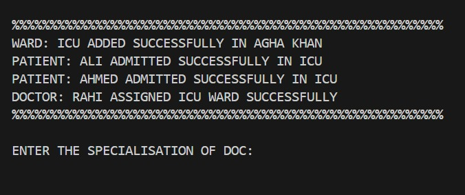
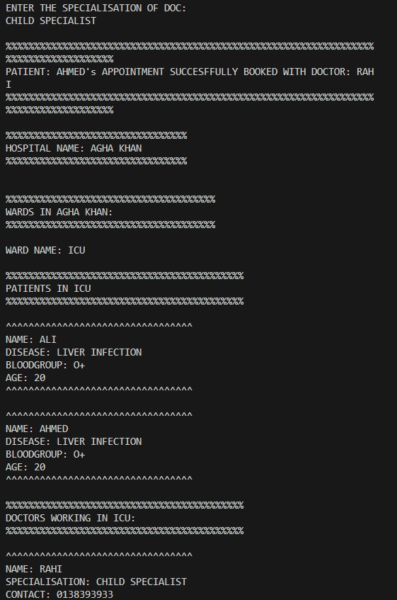

# Hospital Management System

A simple Java console-based Hospital Management System that helps manage wards, patients, doctors, and appointments.

## Features

- Add wards (e.g., ICU, General)  
- Admit patients to wards  
- Assign doctors to wards  
- Book patient appointments with doctors  
- View hospital details, wards, patients, and doctors  

## How to Run

1. Compile the Java files:  
   ```bash
   javac Main.java
2. Run the program:
   
   java Main

## Output Screenshots:
  



## Future Improvements
For in-depth ideas around AI/ML integration and symptom-based diagnosis, see:

[👉 FUTURE_PLANS.md](FUTURE_PLANS.md)

Made by Akhund Mubeen
For the NeuraViaHacks 2025 Hackathon
